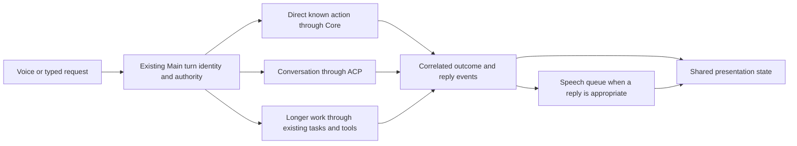

# Morpheus experience specification

## Active voice interaction correction — October 5

The owner authorized the measured next component: explicit voice retry and
clarification, faster recognition lifetime, and coherent audio/state-driven motion.
Baseline `593da4b43e7275a19992a793b1597631473a6a22` is clean and matches fetched origin.
Preserve the separately delivered preview.16 and all owner profiles. Existing
green/red appearance, typed/voice reply scope, selected-input ownership, exact wake
verification, mute, permissions and Core remain authoritative.

Confirmed direction: a failed addressed turn gives a compact nonexecuting repair
cue; a genuine question keeps its task and answer choices and permits a bounded
spoken follow-up after speech finishes. Reuse the included recognizer during active
interaction with bounded idle/disposal and cancellation; evaluate actual pinned
engine behavior before replacing the CLI path. Do not equate worker reuse with
recognition accuracy or weaken wake verification to make tests pass. Finish motion
for these real transitions and qualify native/compact/expanded continuity.

Latest owner steering: a microphone command ends automatically when speech ends;
manual Finish is an optional override. Opted-in companion input remains available
in the tray, accepts exact "Morpheus" and "Hey Morpheus", restores the orb and
acknowledges an admitted wake. Visible expanded chat/Settings suspend ambient input
and manual mute always wins. A clear same-breath command executes once without
planning narration. Unclear input gets a specific nonexecuting retry; actual Core
questions keep their objective and choices. No speculative transcript may act.
The red appearance is now called "Evil Morpheus" and selectable without a preview
label, with two growing horns on both orb and M. This visual choice does not grant
paid entitlement, connect NerdGPT or relax execution permissions. This supersedes
the older appearance-control wording below, not the recorded release evidence.

Hosted recommendation, not connected: keep local wake and included Kokoro speech,
evaluate Deepgram Flux for streaming recognition/turn detection only during an
intentional active conversation, and route final turns through the existing Core
and task-model account. Simple known actions keep the deterministic fast path;
ambiguous objectives ask a question and complex work may use a stronger task model.
An inexpensive text model cannot reconstruct missing audio reliably. Do not train
a proprietary recognizer now or present a new worker as an accuracy improvement.
Flux English currently lists a promotional USD 0.0065/audio minute; task models, service hosting
and other output costs are separate. These prices require rechecking before launch.
See [provider pricing](https://deepgram.com/pricing) and
[turn detection](https://developers.deepgram.com/docs/flux/configuration).
For short recorded commands, Groq's hosted Whisper large-v3-turbo currently lists
USD 0.04/audio hour, with a 10-second minimum billable request. It is a cheaper
transcription alternative, not a replacement for streaming turn detection,
interruption or Core action authority. See
[Groq speech documentation](https://console.groq.com/docs/speech-to-text).
Evaluate both on the same retained command/clarification corpus and real human
microphone samples before choosing a default; provider benchmark scores are not
Morpheus acceptance evidence. Keep Kokoro while assessing recognition and turn
handling; changing the output voice alone cannot fix command understanding.
Hosted audio trades local CPU/English-model limits for network latency, outage
dependence and third-party processing. Funding, operator-owned secure credentials,
consent, quotas and backend service operation remain unresolved; no customer voice
key is required for standard included local voice and no hosted claim is live.

Read-only owner baseline recheck: the running installed package is preview.16 at
`C:\Users\monir\AppData\Local\Programs\Morpheus`, with ASAR SHA256
`5a3306241f43989093fb7a5dd3b068e5ab2db9f9dedbe126fe486fde047890ce`, matching the
delivered normal package. Its existing voice preference selects `engine: provider`
with master/ambient/local-wake/auto-submit/speech/follow-up enabled. Native wake
verification uses included recognition, while explicit capture and speech keep
that saved provider choice. No credentials were read and no profile was changed.
An installed symptom therefore cannot automatically be attributed to Kokoro/tiny
without checking the active path. Fresh-profile local defaults do not overwrite
an existing selected provider. Evaluate wake false positives/negatives, command
recognition and reply sound separately; hosted active recognition must not silently
upload unaddressed ambient audio or bypass admitted-input authority.

Implemented and source/rendered checked: the narrow recovery component resumes
and checks the real microphone meter, ends speech automatically (including setup
tests), reuses bounded included recognition, and presents one nonexecuting retry.
Answers capture exact question run and iteration before recording/editing; their
shared ephemeral draft association follows full/compact transitions. Retired or
replaced questions cannot turn old spoken/typed answers into ordinary requests.
Valid 2–4 choice questions no longer show the unsupported-provider banner or an
empty duplicate Results panel. Actual artifacts/results and no-choice setup
failures remain. Native/React question/retry motion and Evil orb/M horns are
checked; only real RMS drives audio motion. No hosted recognition was connected.

Next exact action: qualify a separately identified normal Windows preview.17
package from the reviewed source and record its exact bytes. Human
accent/microphone/echo and taste require a short
physical acceptance step. Hosted voice remains a later funded, consented service;
no additional user voice API key is required for this local correction.

## Current extension — October 4, public release and Unrestricted appearance

The owner now requests a complete signed public Windows release, broader measured
voice-command precision, Stripe and an existing smart-contract payment integration,
and a red animated evil-Morpheus presentation for Unrestricted. This supersedes the
earlier BYOK-only delivery scope. Preserve preview.15 and all existing user data.
Verified continuation source is clean `cbc43c60505cf431d0af86ce621ab0251f55185e`,
matching fetched origin; the delivered application remains `b27a40af`.

Confirmed requirements:
- Preserve the approved green identity and simple ordinary experience. Prepare
  the requested red Unrestricted appearance with meaningful state motion across
  the existing surfaces, including reduced-motion and hidden-window behavior.
- Appearance, personality preferences, verified subscription entitlement and
  actual service availability remain separate. A clearly labelled appearance
  preview grants no service access or extra execution authority.
- NerdGPT API and its final personality configuration will be supplied later.
  Prepare the integration boundary; never present that service as connected.
- Test multiple spoken commands through the actual included engine, record
  transcription plus destination/intent correctness and latency, retain failures,
  and distinguish generated audio from human/acoustic acceptance. No unmeasured
  claim of Siri-equivalent precision or universal Windows control.
- Complete production signing and payments with actual publisher/service assets;
  verify the resulting signed installer before public-release labelling.

Owner clarification: no signing certificate/service or Stripe account is set up.
Prepare payment options now; live configuration follows later. Intended crypto
flow is USDT/USDC paid to a contract, followed by confirmed on-chain payment and
server-verified account access. The chain, token contracts, ABI, recipient and
pricing/access periods remain unspecified; a new contract may be supplied later.
Signing/publisher setup, backend/domain, prices/currencies and cancellation/refund
rules remain external inputs. No deployed payment service has been inspected. Request
public configuration/paths in chat and keep service secrets, certificates and
wallet private material in secure operator configuration, never in the desktop.
Hosted model funding, runtime coverage and service operations still need acceptance.

Implemented locally for preview.16: saved green/red appearance across native and
React surfaces, distinct red idle/working motion with real RMS-only audio response,
connected Account & Plan/payment explanations, and anchored natural-command/compound
request corrections. Text routing, Main appearance boundaries and real rendered
journeys pass. The 40-case included-engine experiment exposes material recognition
misses; larger base/distil models and changed padding introduced regressions and
were not adopted. Strict transcripts/slots and all failures remain in the checklist.
Generated samples do not qualify human/acoustic behavior or a Siri-equivalence claim.

October 5 package evidence: application checkpoint `b3a0bff5`, qualification source
`f01ebe907b2b4e258a649ce9413a63fa257afe34`, version `1.2.0-preview.16`. The actual
normal package passed connected settings, prepared payment choices, green/red
authority separation, red persistence through process restart, real local PCM
output, deterministic Core execution, generated selected-input wake/Whisper/Core,
compact spoken replies, quiet expanded chat, scope/mute and draft continuity.
The first external qualifier assumed an eagerly created native orb; it was corrected
to use the normal muted hide/show lifecycle. Its failed evidence was retained;
no production change was needed. The passing run recorded no renderer errors.
The actual installer passed CRCs, every payload path/size and 73 selected byte
identities against that tested package. Signature status is `NotSigned`.

The real pinned preview.13→preview.16 upgrade on disposable Windows passed in
run `37227635782`, including encrypted-store, settings, memory/history retention,
same-version reinstall and profile-preserving uninstall. Its first run failed a
qualifier expectation for preview.13's persisted model prefix before upgrade;
that failure is preserved. The corrected qualifier's nine policy tests also passed.
A separate exact-byte normal packaged preview.13→preview.16
API/profile transition passed, retaining the actual old saved model/default, memory,
task history, preferences, mute and opaque protected-key bytes. Its first fixture
stopped the old service before initial startup completed; that failed evidence is
retained, and the corrected fixture waits for actual readiness. No production change
was needed. This local transition is not installation acceptance.
Separate preview.16 delivery contains the identified local installer, checksums,
real 32-second application motion, included-engine PCM and bounded qualification
evidence in the task's `outputs/Morpheus-Windows-BYOK-1.2.0-preview.16`. The local
EXE was inspected against the normally tested package; independent CI rebuild bytes
were actually installed. This remains an unsigned evaluation candidate for Larry.
Exact next work: address the measured recognition failures with an explicit retry/correction flow
and physical command acceptance; do not hide them behind larger-model claims.
Signing and live service availability remain blocked by the confirmed external
inputs above. Successful older-build evidence never approves a changed package.

## Current correction — October 4, command intent and companion voice

Delivery receipt: frozen application `b27a40af226096280a6abc468ecbd6ffb67ba105`,
version `1.2.0-preview.15`, is separately packaged in the task's
`outputs/Morpheus-Windows-BYOK-1.2.0-preview.15`. Actual normal package, generated
selected-stream wake-to-command execution, output scope, lifecycle recovery,
installer integrity and exact-source disposable installation passed. The Windows
checklist records the exact EXE/hash, scopes and remaining acceptance. This is an
unsigned BYOK preview; the owner's installed preview.13 and data remain untouched.

The owner approves the current visual direction and asks for a separate final
delivery with more reliable execution and responsive feedback. Preserve all
capabilities, current releases and user data. Verified source is clean `70cbb324`
on the existing local branch, matching the fetched application branch. The owner
is actually running preview.13. The interrupted preview.14 normal qualification
completed successfully, and exact-source disposable Windows installation run
37198664430 passed; neither proves the newly reported command/wake behavior.

Confirmed next behavior:
- “Go to YouTube and search Mr Beast” searches YouTube, preserving the intended
  destination and query instead of silently replacing it with a Google search.
- Enabled companion voice listens for the wake phrase from the tray/hidden
  companion and pauses automatic capture in visible conversation or Settings.
  Explicit microphone capture remains available; manual mute always wins.
- The owner explicitly selected spoken replies for both voice and typed requests
  originating in the orb/compact companion, with expanded chat quiet. Keep this
  revisitable in Voice settings and preserve explicit existing quiet preferences.
- Improve purposeful interaction feedback within the approved design. Motion
  follows actual capture, execution and output; capability and payment authority
  stay with their existing owners. Do not promise control of every application.
- Produce a separately identified package and delivery folder. “Stable” requires
  evidence for the changed real runtime, not a version-label change.

First work: reproduce destination routing, inspect real tray wake acquisition and
turn-origin speech selection, implement bounded corrections, then run focused
tests and actual packaged journeys. Report synthetic audio separately from human
wake, acoustic interruption and speaker acceptance. No posted credential is used.

Implemented direction and observed causes: deterministic routing matched generic
search before the explicitly named site; Windows wake previously opened the
default microphone independently of the selected renderer input and could publish
armed before acquisition. Actual generated-audio qualification also found Windows
dictation converting “go to YouTube” into “goldie U. two”. The new native helper
receives the selected stream and identifies the addressed sample range only.
Included Whisper transcribes the original range with bounded 300 ms context and
must recognize the exact wake prefix before command admission. The same generated
PCM now yields “Morpheus, go to YouTube and search for MrBeast.” This is generated
audio/native recognition evidence, not human microphone, echo or accent acceptance.
Unaddressed PCM is held only in a volatile 21.5-second rolling buffer and evicted;
no background recording is saved or sent to a provider. Addressed audio follows
the existing guarded temporary WAV transcription path and cleanup. Session,
sequence, size, acquisition, timeout, visibility and mute guards remain Main-owned.

Reply scope is an immutable live-turn origin, never reconstructed from history or
the surface visible when a delayed answer completes. The saved output setting is
independent of microphone consent; typing must not silently enable capture. The
compact meter follows real capture/playback levels and exposes Stop for speech.
Completed-work acknowledgement returns to gentle presence instead of leaving the
orb on a dead final frame; hidden and reduced-motion paths stop animation. Known
legacy capability-list clarification is presented as a short retry, preserving
the full backend capability inventory. Source and package qualification remain
separate gates in the current checklist.

The normal `cff7b03e` package exposed a further lifecycle defect: native tray
OFF→ON emitted repeated asleep projections and retired a pending native token,
invalidating the renderer's replacement acquisition. Preserve pending preparation
during that token handoff; passive sleep without a capture owner must not cancel
a committed settings reload. Errors, mute, foreground and explicit stop retain
their cancellation authority. The regression failed before correction; the normal
packaged journey must pass before this recovery is accepted for delivery.
Main also publishes its effective input-enabled state before a native mute's
audit/persistence completes. This distinguishes an immediate mute from a harmless
token rollover and releases pending/active capture. Repeated muted output events
must preserve new typed reply speech, whose input consent is independent.
Both corrections now pass the final real Electron and normal packaged journeys.
Generated “Morpheus, show system information” admitted exactly one real successful
Core run in 4.37 seconds from input injection. This measures generated input on this
PC, including phrase playback, rather than human speech or acoustic acceptance.

## Current bounded checkpoint — October 4, per-user OpenRouter setup

The owner requests OpenRouter testing and preparation for every user. Each Windows
profile must connect its own task-model account through secure Connections; a
developer or owner credential is never shipped as the application's shared API.
The chat-posted test credential is exposed and is not used or copied into source,
tools, diagnostics or release files. The owner must revoke it and enter a fresh
replacement directly in the application before live-service qualification.

Verified baseline: clean `4ee81a2a91845ff4f2f95d0ba6a6434c581bc6b4` on
`codex/morpheus-preview10-connected-voice`; fetched origin application branch
matches that commit. Preview.13 and its delivery remain preserved. E: has about
131.8 GiB free; C: about 8.1 GiB. Builds and isolated test profiles stay on E:.

The smallest coherent correction is explicit OpenRouter model choice and truthful
per-user setup guidance. Inspection found three concrete defects: model-only edits
could not enable Save; draft validation selected the public catalog before the
OpenRouter-specific authenticated probe; Core could forward a canonical runtime
prefix as part of the native model ID. The form also silently supplied a model,
although the access test does not establish model availability or generation.
The correction uses the documented authenticated `/api/v1/key` metadata endpoint
for draft and saved tests, sends no inference fallback and exposes only safe
classified failures. Core strips exactly one known runtime/account prefix and
preserves native OpenRouter publisher IDs, including `openrouter/auto`.
The original runtime's model-entry/default/fallback paths use the same native-ID
normalizer, so `openrouter/auto` remains the native request model and its canonical
runtime reference is `openrouter/openrouter/auto`. A separate confirmed form race
allowed cancelled validation to reach an account save; setup cancellation now
invalidates the pending operation before mutation. Commit controls distinguish
validation cancellation from a save already entering Main persistence.
Preserve every existing account, model, default, conversation and voice preference.
Real-Main persistence tests then uncovered an inherited destructive list operation:
two saved accounts resolving to the same runtime vendor could cause one account
and its default selection to be removed. Listing must retain saved accounts and
their metadata exactly, including inactive or temporarily unconfigured accounts.
Only missing runtime providers may be imported; a shared runtime credential must
not make another saved account appear configured. The original runtime can keep
one explicitly selected connection per vendor without deleting its alternatives.
That selection must bind model, endpoint and credential to the same account:
reject an unavailable default before changing it, synchronize a selected sibling
after key removal, and bind an unambiguous imported legacy credential securely
before its first sibling is saved. Legacy migration must retain existing IDs.
Modern account/default reads take precedence over stale legacy OAuth records;
legacy-only accounts remain available. No legacy metadata is rewritten to achieve
that precedence. Selected configuration and agent routing precede credential-env
restart, including restored keys, so an older account cannot replace the selected
account's endpoint or model during delivery.
Validate add/edit/default selection and restart retention with synthetic accounts
and a controlled service; record that fixtures do not prove live model access.
Final source verification passed 385 affected unit cases and five Electron
journeys, including same-vendor retention/restart and localized unavailable-default
recovery. The Add dialog initially clipped its action; its fixed footer and
scrollable body now retain fully visible controls at 1280×800 and 800×720.
Normal package/installer verification is the next step; no live-model or physical
voice acceptance is inferred from this source/fixture evidence.
Normal packaged qualification of source `b7a63142` then failed the first protected
account save: the account/key persisted, but the running child's `config.set`
rejected the newly introduced environment SecretRef before its refresh. Setup
layout and authenticated-test boundaries passed separately. Preserve those failed
bytes/evidence; correct and requalify the owned configuration/environment join.
The bounded correction stops only a stale owned child before durable selected
provider/default/agent delivery, then launches with the matching protected env.
Ownership and selection races, manual Stop/Quit and failed pre-launch validation
fail safely; unchanged environments retain ordinary coordinated RPC. Interrupted
service delivery refreshes Connections and presents translated repair guidance,
closing Add when Main has already persisted its account. No generic RPC-error
fallback, credentials in Main's environment or broad Gateway rewrite is introduced.
Final source checks pass 434 affected unit cases and six rendered journeys across
coordinated runs, plus Node/web/managed types, scoped lint and comms/harness checks.
The new recovery journey uses real protected account storage but simulates the
later service failure at Main. Its initial frozen-preload fixture mistake and
passing correction remain recorded. The normal running-service acceptance must
still exercise the actual stage and installer; these fixtures cannot replace it.
Included local English voice stays independent of the task-model key. Hosted plans,
payments and NerdGPT/Unrestricted remain deferred. No broad redesign is authorized
by this checkpoint. Exact next acceptance: save a replacement securely, select an
accessible model, test access, then verify one bounded real reply.

Read-only voice review also confirms a separate outstanding defect: Windows wake
uses the default microphone while Chromium honors the selected input device, and
native wake can start before selected-device acquisition completes. This is not
fixed by a provider key. A future bounded voice patch must correlate readiness to
successful acquisition and share the selected audio source; Chromium device IDs
cannot simply be passed to the Windows recognizer. No physical reproduction or
voice-readiness acceptance is claimed by that source review.

## Confirmed release scope — October 4, BYOK Windows first

After the preview.13 handoff, the owner selected **Complete BYOK Windows release
first**. Finish Basic with the existing local tools, tasks, history, agents,
browser/research and supported site workflow, plus included local English voice.
Preserve the approved Floating companion design and existing configurations.
Hosted Premium/account/payment operations are outside this delivery; retain their
future structure. NerdGPT and the Unrestricted plan are explicitly deferred and
are not blockers for this release. No separate standard voice key is required.

The delivered preview.13 remains a qualified evaluation candidate. A final BYOK
release is not achieved by changing its version label. Remaining engineering and
acceptance belong to the current checklist: live usable model inference and
research/site journeys, real voice/device/wake/interrupt handling, active normal
Chrome context, upgrade/display/sleep and mixed-use performance. In particular,
echo-safe acoustic interruption is not implemented/accepted; settled model replies
are spoken, but partial model-token speech streaming is absent. Cold sample PCM
and playback delays remain observed limitations, not completed responsiveness.

Owner input: repair the saved task-model account securely in Connections and
select a model actually accessible to that account. Metadata connection success
must be followed by a real small inference. A human microphone phrase, audible
sample and physical wake test are required; synthetic streams cannot replace
them. Live publication needs an authorized destination/account: the current
publisher supports an existing public GitHub Pages repository with a separate
gh-pages root and no custom domain, not arbitrary hosting/full-stack deployment.
Connect publication credentials securely and approve the exact preview to publish.

Publisher signing and release/update ownership are distribution requirements for
public customer release; an unsigned private Larry evaluation is already available.
No hosted-plan funding, merchant account, prices or NerdGPT access is required
to finish the standalone BYOK functions. Exact next action: owner repairs the
task connection in-app; verify live inference, then the connected spoken/local
and research/site flows without broad redesign or loss of capabilities.

## Current shareable Windows candidate — October 4, preview.13

The owner now authorizes finishing a polished installable application to share
with Larry, including the recommendations from actual preview.12 inspection.
Continue the approved design and existing backend. This supersedes the previous
one-phrase next-step pause; it does not turn untested hardware or absent hosted
services into accepted production behavior.

Verified starting source: clean `2c8e625a1b8e941f8cdd96af84b62576f881686c`,
`codex/morpheus-preview10-connected-voice`, expected origin fetched without
overwriting. The owner was running preview.12 from its E: review folder.
Builds remain on E: (about 134.6 GiB free; C: about 8.7 GiB). Preserve all prior
packages, divergent checkouts, profiles, history and provider secrets.

Smallest coherent product polish: safe single-step website/application actions
use a concise, specific inline outcome and meaningful motion, without generic
planning chatter or a large result panel. Details stay available; complex tasks,
questions, permissions and errors retain their richer controls. Make genuinely
available starter actions discoverable, while connections and voice readiness
remain explicit. Audit actual included voice timing before any bounded change;
preserve mute, capture, cancellation and no-speech safeguards. No paid fallback.

Qualify the frozen normal package, export actual motion and included PCM, compile
an identified NSIS installer and check its contents. A clean install/reinstall
test belongs on a disposable Windows runner, never the owner's registration.
Larry's first-run profile must contain no owner data or credentials. Basic/BYOK
and included local voice are the shareable offering. Premium, payments and
NerdGPT remain unavailable, with no invented prices or working checkout.

The bounded action/first-success/connection polish and shorter natural speech
clauses are implemented. Final 181 focused unit cases, type/lint/comms/harness
checks and 18 relevant rendered journeys passed. Generated-input speech retained
all 661,356 PCM bytes with a maximum scheduled playback gap of 99.3 ms; this
does not establish physical recognition, speaker quality or live-model latency.

Preview.13 is packaged from frozen application source
`49b0feed7462ddefe6a9b5f50a740b4539c52389`. Normal E2E-off package qualification,
actual motion/PCM and NSIS integrity/identity passed. Exact-source disposable
Windows install/reinstall/retained-uninstall passed; its rebuilt installer bytes
are distinct from the locally delivered installer. The owner now runs preview.13
at Voice, with saved preferences unchanged and history/provider retained. The
local sample completed; a real saved-service test rejected the existing credential.
Repair it in secure Connections setup; never request credentials in chat.

The application is delivered in outputs\Larry-Morpheus with its installer,
short guide, checksums, evidence and actual media. The canonical checklist records
exact hashes/scope. The Windows candidate is unsigned, with manual updates.
Exact next step: Larry's bounded PC acceptance of installation, secure API setup,
microphone phrase/audible sample and spoken local command. Public commercial
release remains gated by physical speech/echo/wake, prior-version upgrade,
signing/update, resource/soak and hosted operations. Earlier sections below
are preserved evidence, not competing execution plans.

## Previous preview.12 — connected Voice review

Keep the connected Voice design. A final independent review reproduced stale
renderer preferences when interaction cancellation discards a committed tray
settings refresh. Main stop/mute authority remains intact. Configuration refresh
validity now survives an unrelated interaction cancel, while stale capture
callbacks remain invalid and cannot restart input. Permission/mute, authority
and newer-setting guards remain enforced; 35 store cases and independent source
review passed. Silence now invites a phrase retry with “I didn’t catch that”
instead of implying unavailable microphone access. Final production build,
generated-input conversation/silence journeys and normal packaged qualification
passed for application source `05426874856222e3b5de946585e27087454b88dc`.
The identified preview.12 now runs on the owner PC at Settings → Voice; original
history/provider and saved voice settings remained intact. Actual microphone
capture opened and gave an honest no-words retry, and the selected voice sample
completed. Physical phrase recognition/wake/echo/audibility are still unaccepted.

Actual typed Open YouTube completed without approval, opening a normal Chrome
window while the prior window remained. Reuse of the current window/profile and
removal of generic transient task copy remain improvements, not accepted behavior.
Keep the scope of this Voice/mode correction explicit. Actual packaged motion,
PCM and report are in outputs\preview12; exact identity/timings and open hardware,
resource, latency and commercial gates belong to the current checklist.

Next is one phrase in Check microphone, then companion wake/action acceptance.
Do not restart the design/backend or redo already qualified source checks without
new evidence. Preview.11 below records earlier scoped evidence.

## Current voice correction — October 4, preview.11 bounded review

Actual owner-PC preview.10 input check opened the microphone but decoded room
noise as `[SOUND]` and wrongly declared the check passed. This is a verified
defect, not successful spoken recognition. Preview.11 extends the existing
Main-owned annotation-only gate for sound/background-sound markers, preserving
ordinary text and mixed quoted commands. The packaged preview.11 owner-PC
recheck opened the physical microphone and reported no words recognized, without
a false pass. Nobody supplied a spoken phrase; this proves capture access and
truthful failure, not spoken command, accent or acoustic acceptance.

The owner enabled microphone access and requested a connected Voice settings
experience, faster natural listening/execution and more fluid motion. Preserve the
approved identity, conversation, settings, backend and profiles. Companion voice
commands are an explicit saved preference. Automatic capture and wake detection
run only in companion scope (main conversation hidden/minimized); opening full,
compact or Settings suspends them. Chat accepts typed input by default and uses
the microphone only after an explicit press. Returning to companion restores
saved consent; master microphone mute always wins. Hiding never enables consent.

Group companion command consent and master mute, microphone/device/input test,
and selected natural sound/output sample together. Keep secondary captions and
provider options available without overwhelming the essential controls. An engine
being installed is not a successful microphone test. Errors override armed-state
labels and lead to the relevant repair controls without losing the conversation.

Live preview.9 inspection after the owner's permission change opened actual
microphone capture successfully. The finished test detected no speech; recognition
and physical speaker/echo quality are not verified. The same UI incorrectly said
"Morpheus is listening for you" beside its no-speech error. Prior measured cold
output and chunk gaps remain latency evidence; cosmetic motion is not a latency
fix. Automatic echo-safe acoustic interruption remains unimplemented.

A short real bundled-engine observation emitted "Opening YouTube" PCM after
2.209 s cold, versus 1.052 s after 1.109 s preparation. Preparation is useful
only when overlapped with recording; it does not remove recognition or playback
latency. The standard engine remains local CPU Whisper/Kokoro. Keep the measured
900 ms explicit / 1000 ms companion end-of-speech thresholds until real speech
pause/accent evidence supports tuning. A prepared worker can remain cached for
up to 60 seconds after an ordinary Stop; mute/output-off, configuration change
and shutdown release it. No perpetual idle warming or paid fallback.

This bounded Voice/mode component is now packaged as preview.11, application
source `5a21fc3ba1f9b08b9a9e60ec80f7d643151e14d9`. Normal packaged first-run,
real included output/Core result, navigation/draft continuity and mode/mute
lifecycle checks passed. Chromium capture in automated lifecycle checks is
silent/synthetic; the Windows default-microphone wake helper really starts and
stops, but physical speech/wake and native tray UI clicking are not accepted.
The owner app now runs this payload at connected Settings → Voice with existing
history and unchanged saved voice preferences. Included sample playback completed
there; audibility/echo is still a physical gate. Actual packaged motion/audio
media and the concise report are in this task's `outputs\preview11`.

Next: one real phrase in Check microphone (“Open YouTube”, then Finish), followed
by companion wake/action acceptance after input is confirmed. Calibration never
executes a command. Keep the identified package and approved design; the current
checklist owns exact hashes and timings. This does not close commercial release,
long-output synthesis gaps, resource-budget or acoustic-interruption gates.

The connected Voice component is implemented. Native tray consent changes now
publish a committed settings revision to the renderer, which reloads once and
uses the same capture owner as Settings. Pending mute, native visibility and
failed-acquisition recovery still govern input. Do not restore automatic native
startup to work around a stale renderer cache. Initial package exercises found
two qualification-script navigation/ownership mistakes; their reports remain
preserved. Final passing preview.11 qualification used actual Voice controls plus
the native tray's Main settings service rather than seeding renderer readiness.

## Current correction — preview.9 review build

The owner authorized the bounded correction after the preview.8 rejection below.
Keep the approved Floating companion direction and existing runtime owners.
The current implementation reserves layout space for voice status, labels Settings
in compact/full, aligns conversation and task bubbles with the composer, and gives
connected Settings the same typography and palette. Voice repair keeps the origin
and draft; welcome owns its status controls inside the modal focus boundary.
Opening Voice settings preserves an existing microphone failure until deliberate
retry or repair. A successful settings edit settles a cleared failure to idle;
reading or saving configuration does not assert a successful microphone test.

The original header M now reveals and gently breathes/tilts; the original orb
artwork itself moves at actual desktop sizes. Quiet motion uses two moving layers,
with reduced-motion, hidden-window and covered-surface guards. Listening/speaking
deformation follows the existing real microphone/PCM meter; zero signal stays
steady. Presentation state fixtures are not microphone evidence.
Hidden/covered surfaces remove decorative animation instances and restore them
when shown. A measured Chromium case reported `paused` while clocks advanced;
the verification now checks absent animation instances and stable transforms.

Included local input now rejects near-silence, DC bias and isolated clicks before
decoding, and rejects known annotation-only output before draft/routing. Valid
short answers remain accepted. This conservative gate is not a full speech/noise
classifier; ordinary-prose hallucinations and physical acoustic quality remain
open. No provider configuration, speech model or credentials were replaced.

Next gate: review the actual corrected Windows shell and short motion recording.
Check visible Settings, compact/settings/return, aligned messages/results and
motion at ordinary size before broader work. Package identity, scoped verification
and remaining physical/commercial gates are maintained in the current checklist.
Do not label this review build production-ready or reinstall over the owner's
existing app as part of automated qualification.

## Current owner review — preview.8 rejected, 2026-10-03

The approved study did **not** establish acceptance of its implementation. The
owner rejected preview.8 alignment, navigation and visible motion. Treat the
integration/qualification sections below as scoped historical evidence, not a
completed experience. Preserve the selected Floating companion direction, identity,
backend and profiles; another broad rewrite or installer is not the next step.

Live Windows inspection restored the installed app and reproduced the wake badge
covering the full conversation navigation. Ctrl+Shift+Space opened compact;
its Settings control opened connected Voice settings, and Advanced exposed the
preserved settings/workspace links. The user-supplied 162.93-second recording
also shows the overlap, inconsistent surfaces and raw recognition artifacts.
At about 74 seconds, a non-speech annotation occupies both the input and text
above it; around 154 seconds, compact shows a raw blank-audio marker. The same
marker was visible in the live app. No new microphone capture or provider request
was performed during this inspection.

Confirmed preview.8 implementation gaps (addressed by the correction above):
- Ambient status is a high-z-index fixed overlay at `top-11`, with no layout
  space reserved; it covers Settings/history/compact/More in CommandCenter.
- The header M is a static image. Consecutive video frames (74–77.5 seconds)
  show movement in narrow outer orb contours, with a static center. Animation
  existence does not establish perceptibility or the approved expressive motion.
- Conversation layout combines JSX spacing, global CSS and experience overrides;
  messages add their own left inset. Connected Settings still uses different
  surfaces/typography from the conversation. This is not a unified shell.
- Local ASR returns trimmed engine text; the service rejects only an empty string
  before the renderer copies it into the draft. Non-speech output needs semantic
  rejection and actionable recovery. Do not merely hide a bad transcript.

Authorized correction: one connected conversation shell, with a reserved in-flow
voice-status area, visible labeled Settings, consistent content/composer alignment,
and recognisable motion at the actual compact/full sizes. Verify wake enabled,
active/error states, reduced motion, resize and compact→Settings→return together.
Pair that with a bounded silence/noise transcription correction before claiming
a successful spoken journey. Keep tests and actual user acceptance separate.
Full speech quality, acoustic interruption, provider replies and release acceptance
remain open; this inspection is not a new qualification of them.

Updated 2026-10-03, Asia/Dhaka. **Approved design; implementation authorized. The owner
has rejected the preview.7 UI/UX as well as the earlier preview.5 experience.**
The owner subsequently approved the recommended direction: Floating companion
by default, opening into the Conversation card, with temporary editable voice
captions. They requested a more animated opening page and visibly animated existing
M logo. This advances the connected motion study; it does not accept the rejected
application or qualify live voice. Computer control stopped when the owner pressed Escape.
The owner then accepted the connected study ("It's great") and requested the final
production application, connected settings, and major voice/animation improvements.
This supersedes the design-only hold. Implement without another design restart;
qualify the actual Windows package, and retain explicit hardware/service evidence limits.
This is the single current experience specification, reconciled from the existing
design review and the owner's October 2 correction. The single current execution
checklist is [WINDOWS_COMPLETION_CHECKLIST.md](../releases/WINDOWS_COMPLETION_CHECKLIST.md).
Historical plans, prototypes and automated results remain evidence, not approval.
## Preview.8 integration — approved design and measured runtime

The approved design is implemented through the original runtime owners. The exact
M logo animates on arrival; the 56-DIP orb uses smooth contours and actual RMS.
Compact/full share conversation, draft and tasks. Settings preserve their origin,
including Voice repair and Advanced return. Caption visibility is a persisted UI
preference only; it never changes microphone consent. Personality exposes existing
proactivity/quiet controls. Manual typing cancels capture/output before editing.
Main now accepts fixed cursor-based drag and keyboard placement actions, saves
bounded relative display placement, and opens the conversation inward. No arbitrary
renderer coordinates or additional execution authority enter that bridge.
Live voice-origin ACP replies correlate their original admitted turn and live
completion, then speak once through the existing queue. Restored/typed replies stay
silent. The pinned local Kokoro worker reuses a bounded native process, starts only
for addressed speech, unloads after 60 seconds idle, and dies on cancellation/quit.
A local-only 450 ms initial PCM buffer reduces phrase gaps; short completed answers
flush immediately. Physical acoustic barge-in is **not implemented/qualified**:
manual microphone, typed input and Stop interrupt; capture while speakers play
remains suppressed until a real echo-safe design is tested.

The first integrated package at `f6ea7144` passed normal isolated runtime and
generated-input ordinary ACP speech: three original conversation turns, complete
PCM playback and typed/manual Stop within 30 ms in that run. Source-level installed
Windows install/reinstall/uninstall passed on a disposable runner. Model answers
were loopback fixtures; the recorder, local recognition, Gateway, PCM and playback
were real. These results do not establish physical microphone, wake or audibility.

Resource budget is part of the design. This PC's display runs at 200 Hz. Native
measurement found that continuously repainting the organic contour was expensive.
The final correction keeps a static organic contour and animates compositor
transforms/opacity, with idle motion limited to approximately 30 updates per second.
Hidden surfaces must pause all motion, and reduced motion remains respected.
An inspector-only comparison motivated the correction. Final source `24ebf455`
then passed native motion and real PCM speaking checks: the comparable visible
observation fell from 92.68% to 17.54% of one CPU core, and hidden usage was 0.20%.
The 32-second clip retains actual 56-pixel native captures without enlargement.
This does not establish long mixed-use or low-power hardware performance. The
same source also passed isolated normal package, generated-input ordinary voice
and disposable Windows installation; exact identities and boundaries are in the
completion checklist.

Voice latency is also an experience limit: a first cold packaged sample took
4.149 s to emit PCM and 4.633 s to report actual playback on the final package,
while shorter/warm
worker samples were faster. Keep those conditions separate. The included local
English voice avoids a separate key and per-utterance hosted charge, but uses
local CPU/RAM and installation space. Hosted quality/latency/privacy/funding and
physical recognition/echo still require independent qualification.

The following baseline findings explain the rejected build and are historical;
they do not describe the completed source changes above or qualify their package.

## Preserved preview.7 baseline

The delivered implementation baseline was **1.2.0-preview.7**, application source
`757f71c5f7e98d560624657a12875dba4330c7ac`. Actual normal packaged startup, held
active-reply reload with exactly one inference, full restart, original tagged-persona
history, canonical task/chat chronology, visible latest compact reply, draft and
contextual settings passed. The model reply is a bounded loopback fixture; original
Gateway/ACP/Core/history and native controllers are real. No new conversation owner.
Main owns admission settlement and retained authority; it does not replay every
missed live stream chunk or automatically approve an unanswered permission.

Real generated English speech -> Main STT -> Core execution -> original renderer
playback passed. All 137,640 declared PCM bytes were received, scheduled and
naturally ended; typed Stop interrupted another reply in 82 ms. This tests generated
input, not physical recording-owner dispatch, microphone, wake or speaker audibility.
October 3 source audit confirms a missing product connection: voice-origin ACP
conversation can receive a text answer, but automatic speech watches Core objective
summaries/clarification only. Ordinary ACP replies and their spoken follow-up are
not connected. The successful Core command test does not qualify general voice chat.
Included synthesis starts a fresh offline engine for each phrase, then emits the
finished phrase's PCM; it is not continuous synthesis from incoming model tokens.
Motion preserves static artwork with CSS light/halo movement. Quiet motion updates
five times per second and audio drives a modest halo scale/opacity, not organic
artwork deformation. These are implementation limits, not proof of the owner's
current microphone/device failure. Standalone voice samples join actual PCM without
live generation gaps; the orb review clip enlarges 56 DIP sixfold. Neither proves
ordinary desktop conversational fluency.
Actual muted native motion and continuous-interface recordings are 16/20 seconds;
simulation, hidden padding and isolated Main restoration boundaries are labelled.
Scope-specific installed Windows install/reinstall/uninstall passed on a disposable
runner; the CI EXE differs from the statically verified local delivery EXE.

The local EXE is 480,418,659 bytes, SHA256
`19a0bafe7e9c8d1792876d127dc05d63962142938464fddcd6b72b0fa70a82e2`.
Archive integrity, all 40,896 paths/sizes and 44 selected hashes match qualification.
It is unsigned. **Commercial launch is not qualified**: signing/update, hosted
operations/funding and payment setup are absent; NerdGPT is deferred. Physical
hardware/owner upgrade/live paid-provider/publication and long-session gates remain
open. Fresh Gateway startup was 62.827 s; returning window/Gateway 2.756/7.679 s.
Local CPU speech can leave generation gaps; no low-power latency/quality promise.

Rejected candidates remain evidence: `5b93a145` duplicate reload dispatch,
`23d7bae9` truncated playback and `24945c32` restart chronology/viewport failure.
Their EXEs/payloads/logs are preserved under the corresponding rejected/pre-scroll
directories in `E:\Morpheus-builds\experience-preview6\evidence`. The correction
uses original settled start times from the existing bounded transcript supplement;
invalid, reversed or ambiguous dates remain unknown. Only deliberate reading
gestures suspend following, and native regression measures the clipped viewport.
Preview.6 results below are a preserved baseline; the current checklist records
the final candidate and exact evidence boundaries.
No meaning is inferred from standalone historical A/B/C/D answers whose questions
are unavailable. The original design review is recoverable in Git at `4a9f25e9`.

## Product and preservation contract

**Approved direction: a movable floating companion and connected conversation card.**
Default to a small companion on the desktop; open a compact conversation when
needed and expand for substantive work. Remove the continuous Matrix-rain wallpaper
from ordinary conversation. Use near-black solid surfaces, restrained emerald light,
comfortable readable type and spacing governed by content. Reserve the brief Matrix
arrival for introduction. Keep the existing M and green/black identity.

The owner's current screenshot rejects the oversized empty conversation, static
greeting, stretched composer and decorative background. Live October 3 inspection
confirmed the installed per-user preview.7 EXE and app.asar match the delivered
payload. The merged old text visible in history needs investigation; its root cause
has not been reproduced. Do not clear or rewrite owner history to hide it.

Default companion character: capable, warm, quietly witty. Ordinary status must
describe the user's activity only when useful. Do not show "thinking", "planning",
model names, or internal reasoning in the normal experience. Longer work still needs
honest progress, cancellation and actionable failure feedback. Advanced diagnostics
remain available. No false human identity or fabricated understanding/progress.

Morpheus is a polished Windows desktop assistant and companion. Preserve the
existing M logo, selected green/black orb and restrained Matrix identity. Use
excellent spacing, typography, feedback and fluid motion; decorative rain cannot
substitute for interaction design. Preserve Electron/React, OpenClaw, Objective
Core, agents, tools, tasks, history, browser/provider integrations, profiles,
credentials and settings. Main retains authority, audit, permissions and recovery;
renderer calls use the existing typed host boundary. No second conversation engine.
Shared contracts remain portable; delivery is Windows only. Existing advanced
capabilities stay available under Advanced without dominating ordinary navigation.

## First-user journey

The installer stays practical. Personalized setup happens after installation.

1. Brief, skippable animated "Welcome to the Matrix" arrival; introduce Morpheus,
   ask what to call the user, and retain the answer. Do not repeat full onboarding.
2. Obvious Connections step: detect existing configuration and preserve it; securely
   connect the task-model API in the application, test the connection, and explain
   precise errors. Explain BYOK versus hosted plans. Never request secrets in chat.
3. Standard voice is included for every user, including Basic, without a separate
   voice API key. Provide microphone selection, permission guidance, a real input
   test and audible natural English sample. Detect configured does not mean tested.
4. Default personality: capable, warm, humorous. Movie/anime/One Piece references
   are welcome when relevant. Offer lightweight choices with brief examples and
   real voice previews when available. Persist across surfaces and model routing;
   Personality settings revisit choices without restarting onboarding.
5. Guide one real first success, such as opening an installed app or website.
   Show a few capabilities actually available on this PC. Setup may be skipped,
   but clearly identify unavailable functions; never call an unconfigured app ready.

Settings connect to activity: **Connections, Voice, Personality, Account & Plan,
Advanced**. A failure opens its relevant repair step, preserves the interrupted
conversation/draft/task, and returns there after repair. No detour into Models or
an inherited technical workspace for ordinary setup.

## Presence and continuous interaction

Orb -> upward-opening compact conversation -> expanded conversation/results ->
compact or hidden. Retain the same conversation, draft, task state and personality.
Expansion gives more space and richer results. Composer, readable responses, mic
feedback and controls must be deliberately arranged; avoid a stretched input across
empty space. Explicitly opened workspaces remain readable until the user leaves.

The small bottom-right orb sits safely inside the actual display work area above
or beside the taskbar. Verify taskbars on each edge, DPI/text scaling, display
changes and removal, auto-hide, small work areas and sleep/resume. A usable target
can be larger than its visible artwork. Historical 100-DIP size is not approval.

**New confirmed requirement: freely movable companion. Proposed behavior:** drag
to reposition, optionally snap gently to a safe display edge, and remember the
placement per display. Distinguish click from drag; offer a keyboard Move command
and Reset position. Clamp saved coordinates into the current work area when a
monitor disconnects or scaling changes. A panel opens inward from the saved position,
upward at the default bottom-right dock. Keep its focus and hit target stable while
the animated surface changes shape.

Compact should show recent dialogue, a transient editable transcript, the current
result when useful, and one composer with mic, send/stop and expand. Suggested width
360-420 DIP, height based on content with a work-area cap; these dimensions are for
prototype review, not approved implementation constants. Expanded view gives the
same conversation more room and an optional results pane. Ordinary history/results
must remain recoverable without an Advanced detour. No permanent hero above history.

**Retained behavioral requirements; implementation acceptance remains open:**

- Visible artwork about 48-56 DIP, with at least a 44-DIP interaction target;
  initial 16-DIP work-area inset, adjusted if actual taskbar/scaling tests require.
- Fade after about 10 seconds of inactivity following a completed interaction.
  Keep visible while listening, playing speech or awaiting the user's answer.
  Editing/reading/focused compact UI should not disappear unexpectedly.
- Background work does not hold the orb open. Completion uses a restrained
  notification under the user's preferences; do not steal focus.
- Explicit shortcut, tray click or enabled wake phrase restores the companion.
  Wake listening runs only when enabled. Manual microphone mute always wins.
- Hover preview never takes keyboard focus; click/tap/typing shortcut does.
  Preserve the draft through dismissal. Hidden visual loops stop.
- Genuine spoken clarification leaves time to answer; initial clickable fallback
  approximately eight seconds after question playback ends. Cancel on speech or
  typing; no invented options for bare wake silence or ignored social check-ins.

Dismiss hides presentation and preserves work. Tray keeps the application running.
Mute stops microphone capture/wake; visibility never implies unmuting. Stop speech
cancels playback/generation; task cancellation stops only the selected task. Quit
ends application/audio and performs orderly task shutdown/recovery. Label each
control clearly and verify its actual lifecycle behavior.

Animate idle, listening, working, speaking, question, error and dismissal. Actual
capture/playback state and bounded audio level drive listening/speaking feedback.
A prototype may demonstrate these states with an explicit simulation label;
production must never fabricate audio activity or progress. Respect reduced motion,
keyboard/IME, screen readers, readable contrast and high text scaling. Motion should
be noticeable during active interaction and quiet while idle. Hidden animation costs
must be measured across the process tree.

**Proposed motion score — review at actual desktop size and in reduced motion:**

| Moment | Visual behavior | Source of truth |
| --- | --- | --- |
| Idle | Slow, smooth changing contour and internal green light around the stable M | Presentation only; never suggests an open microphone |
| Listening | Surface opens slightly; light and contour respond to real input with controlled attack/release | Actual selected-mic capture and energy, with optional live transcript |
| Request accepted | Brief settling gesture flows into the relevant next state | Final transcript accepted and routed, not a partial guess |
| Executing | Directional current; a short action label only if useful or delayed | Real action lifecycle; no fake percentage or planning narration |
| Speaking | Asymmetric pulses distinct from listening, preserving the same geometry | Real scheduled playback, including silence and generation gaps |
| Question | An open, expectant shape with concise question/options; sufficient answer time | Actual unresolved clarification or authority request |
| Done / failure | Brief resolve-and-settle; failure holds a clear repair affordance | Verified outcome or reported failure; never silence over a consequential error |
| Open / move / dismiss | The same orb anchors the panel and carries position/momentum between surfaces | Actual window state; no focus theft or fabricated window morph |

Use a shared presentation component and motion parameters for native orb, compact,
expanded view and introduction. The approved artwork need not be replaced to animate
the surrounding silhouette and light. Benchmark smooth motion at real size; a larger
exported video is not appearance acceptance. Hidden decorative rendering stops.

## Proposed voice and interaction architecture — not implemented

Preserve the existing Main assistant-session, ACP conversation/history, Core actions,
provider secrets and task authority. Extend the existing voice coordination boundary
to follow the same original live turn through conversation or action execution.
Do not create a second conversation history or competing action router.

1. One selected microphone governs capture and wake. Share consistent device identity
   and failure guidance. Partial recognition can provide editable feedback, but
   only finalized, addressed requests can cause actions. Qualify real echo/noise
   handling and same-breath wake plus command; do not infer them from generated input.
2. Keep the included local inference models warm during an enabled voice session,
   under measured idle memory/CPU and unload rules. The current offline CLI exits
   after each phrase; genuine persistence requires a qualified worker/binding.
   Incremental recognition likewise needs a capable recognizer, not a renamed batch
   call. Benchmark alternatives before choosing or promising quality.
3. Ordinary voice-origin ACP answers must feed the same cancellable speech queue as
   Core replies. Enqueue stable sentences as they become available; synthesize ahead
   of playback. Suppress internal planning/tool text, duplicate segments and historical
   replay. Preserve turn/generation identity through reload, interruption and routing.
4. Simple commands execute quietly. Rich answers and necessary questions are spoken
   when enabled. Local results should say what happened rather than "completed one
   step and produced one artifact". Persona informs concise wording without adding
   an extra model call to every action; acoustic expressiveness must be auditioned.
5. A confirmed spoken interruption stops current output and invalidates stale queued
   audio, then admits the new turn. Stopping speech does not silently undo an action
   already completed. Task cancellation remains explicit and correlated. Manual mute
   blocks all capture/wake; follow-up listening is bounded and visibly indicated.
6. Presentation observes actual events and audio; it never owns microphone authority,
   task execution or secrets. Short recognition/synthesis gaps must be represented
   truthfully, while motion transitions stay visually continuous.

Standard voice remains included without another user API key. First evaluate a warm
local architecture for quality, latency, accent handling, offline privacy and resource
use. Product-funded hosted voice is a separate optional service decision requiring
cost, privacy, allowance and operational agreement. Existing BYOK is task-model access.
Neither a key purchase nor a hardware upgrade is the remedy for missing reply wiring.

Proposed acceptance targets on an agreed Windows PC: warm first audio within 1 s
of stable speakable text, avoidable generation gaps below 200 ms, typed Stop below
150 ms, confirmed spoken interruption below 300 ms, and zero duplicate action or
historical speech replay in the exercised journeys. These are targets, not results
or guarantees. Measure end-of-user-speech to audible answer separately, including
recognition and provider delay; report cold startup and p50/p95, not a best sample.
Owner acceptance of naturalness and real microphone accuracy is required.

## Included voice architecture — preview.6, refined in preview.7

Preview.6 bundles sherpa-onnx 1.13.8 static Windows executables, Whisper tiny.en
int8 recognition and Kokoro v1.0 int8 synthesis. English is the included standard;
Michael is the default warm voice, Heart an alternate. No voice API key, account,
download on first use or service payment is required. Existing provider speech
adapters remain available in Advanced; their stored configuration is preserved.
Windows System.Speech provides opt-in local wake detection, not the default narrator.

Each addressed recording is canonical mono 16 kHz PCM WAV. Main owns a bounded,
cancelable subprocess and temporary utterance directory, removed on success,
failure and cancellation. Audio stays local. No persistent engine process runs
while idle. Local wake uses the Windows default microphone; the selected device
applies to command/test capture. Manual mute blocks both wake and input. Output
samples remain usable while input is muted. Recording tests never execute commands.

This CPU implementation trades install size and startup latency for offline privacy
and zero per-utterance service cost. Preview.7 generates a short first phrase followed
by bounded sentence groups and streams validated 24 kHz PCM through the existing
audio player. Up to eight available CPU threads replace the fixed four-thread TTS
setting after a real sequential engine benchmark (25-word baseline: 13.075 s at four,
9.508 s at eight). This is segmented speech, not token-by-token model streaming;
generation can still outlast playback on slow CPUs. Genuine gaps show zero audio
activity and do not reopen microphone capture while synthesis continues.
Main declares streamed PCM chunk count and byte length; renderer completion waits
for that whole ordered sequence before finishing playback. Cancellation or malformed
streams cannot resynthesize automatically. Native qualification compares all received
PCM bytes with actually scheduled and naturally ended AudioContext frame bytes.
Tiny English recognition can mishear accents,
noise and speaker echo. Actual microphone accuracy, naturalness, echo/interruption
and low-power hardware acceptance remain owner tests. Hosted speech could offer
stronger recognition or faster streaming, but no service account, funded allowance,
retention policy or operating arrangement has been supplied; no hosted voice is live.

Pinned artifact hashes and provenance are in `scripts/prepare-local-voice.mjs` and
the packaged `local-voice/manifest.json`. Sherpa/Kokoro are Apache-2.0, Whisper and
ONNX Runtime MIT; the independent eSpeak phonemizer is GPL-3.0. License texts and
corresponding upstream source/build archives ship with the executables. Source is
unmodified. These records identify distribution inputs, not a legal certification.
Primary documentation: https://k2-fsa.github.io/sherpa/onnx/tts/pretrained_models/kokoro.html
and https://github.com/k2-fsa/sherpa-onnx/releases/tag/v1.13.8 .

The owner subsequently authorized autonomous completion and testing. Preview.7
addresses demonstrated speech delay, misordered task exchanges, credential-bearing
public-research links, pinned connection fallback and cancellation during final
website verification. An isolated hosted Windows runner qualified install, runtime,
same-version reinstall and default uninstall at final source `757f71c5`, without
writing the owner's Windows registration. Evidence is recorded in
the same current checklist; no new competing experience plan is introduced.

| Candidate | Required evidence and tradeoffs |
| --- | --- |
| Local neural STT/TTS | Natural English taste, accuracy, download/install size, CPU/RAM/GPU use, startup and response latency, offline behavior, licensing. Addressed audio remains local; verify network behavior. |
| Product-funded hosted STT/TTS | Real quality/latency, audio destination and retention, transport/privacy, hosting account and service operation, metered cost, abuse limits and a funded allowance. No user-supplied voice key. |
| Windows speech fallback | Useful recovery only with truthful voice identity; do not label robotic output as the approved natural voice. |

Measure microphone selection/permissions, speaker echo versus headphones,
same-breath wake+command, interruption, typed follow-up, silence, mute, unplug,
lock and sleep. Specific failure -> repair -> resume. Included cloud speech still
costs money; hosted funding/allowance are unresolved and must be disclosed. Those
inputs must not block independent local voice evaluation or BYOK interface work.

## Behavior, capability honesty and cost

Clearly requested app/website actions use existing direct execution without
unnecessary questions, model planning or approval dialogs. Ask for meaningful
ambiguity or consequential authority. Unrestricted never bypasses user control,
secure handling or payment approval. Support cancellation, natural interruption,
typed follow-ups and understandable partial failure/recovery. Optional jokes and
check-ins adapt to explicit preferences; never claim emotional awareness.

Use deterministic dispatch and capable inexpensive routes for simple work; bounded
stronger routes for complex work. Preserve context/personality across routing and
keep unknown usage distinct from zero. Do not add an extra model pass for humor.

**Confirmed browser requirement:** "Open YouTube" opens in the user's existing
normal Chrome session/profile, with a brief visual acknowledgment and no planning
speech, approval ritual, technical browser workspace or isolated profile. Prefer
the relevant active Chrome window; if multiple profiles make selection ambiguous,
offer a one-time profile preference. If Chrome is not running, open its chosen normal
profile. Specify and test actual focus/tab behavior in the browser adapter: the OS
default-browser opener alone does not prove it chose the active Chrome profile.
Actual browsing automation requires an explicit connection to the selected browser
context. Preserve isolated automation for workflows that need it, without silently
copying cookies or exposing all personal tabs to an agent.

**Proposed companionship defaults:** occasional situational humor, and one optional
daily check-in at the first suitable interaction or a user-selected time. Reuse saved
preferences and frequency/quiet-hours controls. No catch-up burst after absence, no
repeating greetings on each launch, and no interruption during calls/fullscreen/DND
where that state is known. A silent acknowledgement stays silent; jokes do not block
actions. Show a short example during Personality setup. Movie/anime references are
occasional, not the default answer to every request. Never infer emotions.

The first journey should finish with one actual command and its verified outcome,
then show a small capability selection based on actual availability. Repair settings
must return to the originating surface and interrupted interaction. Focused editing,
an unfinished draft and explicit reading must suspend automatic dismissal.

The following inventory records Checkpoint A's historical preview.5 findings.
Current preview.7 verification is in the single completion checklist.

| Capability group | Existing owners to reuse | Checkpoint A / preview.5 evidence boundary |
| --- | --- | --- |
| App/website actions; window/media/volume; files/clipboard/reminders/system checks | `shared/morpheus/actions/registry.ts`, `electron/services/morpheus/index.ts`, Win32 adapters and Core | Implemented source; prior synthetic/local qualification. This inspection did not execute commands or approve all hardware effects. |
| Conversation, draft, tasks and history | Main assistant-session, original ACP/history, conversation/command stores | Prior packaged fixture evidence; installed compact turn became hidden on expansion in this inspection. |
| Public browser and cited research | Worker port/browser adapter, research report and results renderers | Implemented bounded public paths; live quality and authenticated account scope remain unverified/unfinished. |
| Website create/revise/preview/publish | Existing static verifier, pinned interactive templates, revision snapshots and protected GitHub publication owner | Source/local fixtures; arbitrary full-stack and form delivery not supported; live target/publication acceptance open. |
| Providers and secure setup | Provider service/settings, protected secret store and migration, typed validation API | Implemented protected foundation; connection testing exists but is difficult to find. Existing account detection must be reused. |
| Introduction, personality, voice and check-ins | Activation/onboarding store, persona context, voice service/player/wake, social policy | Implemented fragments; connected first journey and included voice remain unaccepted. |
| Tools, agents, channels, schedules and existing administration | Current OpenClaw routes and advanced pages | Preserve functionality; move ordinary navigation away from technical surfaces. |

Every capability presentation labels **available**, **unconfigured**,
**experimental**, or **planned** using actual runtime evidence. Do not advertise
speculative income generation or autonomous success as guaranteed functionality.

## Account, plans and NerdGPT

Keep account/subscription entitlement, personality preference and actual service
availability separate. One application/runtime serves all plans.

| Plan | Intended presentation | Actual current service state |
| --- | --- | --- |
| Basic | Bring your own task-model API; included standard voice | BYOK foundation preserved; included local recognition/synthesis bundled in preview.6, pending owner microphone/quality acceptance. |
| Premium | Hosted quality models and supported voice | Unavailable; incomplete runtime/accounting and no supplied hosted operations. |
| Unrestricted | Premium plus future NerdGPT spicy humor, profanity and roast personality | Planned; NerdGPT is the owner's platform and integration is deferred. |

Optional evil-Morpheus animation may accompany an appropriate future experience;
never imply NerdGPT is connected or a purchase activated. Stripe and crypto are
requested payment methods, not configured services. No prices, fake entitlement,
trial balance or working checkout. Pricing, business country, server/domain,
payment accounts and hosted funding/operations remain open external decisions.
Local plan presentation and BYOK work can proceed without them.

## Checkpoint A evidence — 2026-10-02

- Current chat directory is projectless. Verified application worktree:
  `C:\Users\monir\Documents\Codex\2026-09-18\morpheus-experience-reset\morpheus-phase7`.
  It was clean/detached at `4a9f25e9e2a715572cd0a75c9205b9de681f82f4`.
  Verified origin `https://github.com/MoNaBOSS/Morpheus.git`; fetched without
  reset/stash/checkout. Remote authorized branch matched that full commit.
- Original `C:\Morpheus\morpheus-core` was clean on the application branch at
  `fa988f06ebeb41d070accc337cee1cea7cad0b39`, behind 31. It is preserved.
- Installed/running `C:\Program Files\Morpheus\Morpheus.exe`, registry version
  `1.2.0-preview.5`, executable file version same. Installed executable, app.asar,
  motion CSS and OpenClaw manifest hashes exactly match delivered candidate
  metadata. App.asar SHA256:
  `63efecda7b5e267275342310436efcd2510171c834779569e5fffd0f3d63ccf1`.
  Delivered installer SHA256:
  `cf82b227b90299bc1be1cf01bacfe7421be267449f37cf7c9cfd90e98b60b9c4`.
  Candidate application source `c8d021dda41d7abfeff8511bc1988b17b794ecad`;
  subsequent commits through baseline modify documentation only.
- Storage checked before any build: C: 10,221,359,104 bytes free (~9.5 GiB);
  E: 167,552,888,832 bytes (~156 GiB). No build/install/dependency download ran.
- Read AGENTS, Sol/CLAUDE orientation, required Phase 7 plan/architecture/ledger,
  H/I evidence, Windows checklist, preview.5 handoff and relevant source owners.
- Computer Use inspected actual installed orb/upward composer, compact,
  expansion and Settings. Owner interrupted the first pass with physical Escape;
  interaction stopped, then resumed only after explicit owner authorization.
  No credentials entered, mic enabled, paid request, command or subscription test.
  Screenshots/trees appeared in chat; no private transcript or credential copies
  were saved as deliverables or committed.

| Gap | Evidence / cause | Qualification |
| --- | --- | --- |
| Oversized empty compact/composer | Native installed capture; `MorpheusQuickCommand.tsx` stretches a flex log into a 440x520 default and anchors input below it. Full empty mode centers a very wide composer. | Observed plus source-confirmed layout. |
| Compact history absent after expansion | Native settled full capture. `CommandCenter/index.tsx:59` sets `data-empty` from task runs only; `globals.css:1269` hides all messages when there are no objective runs, including ordinary ACP conversation. | Reproduced installed failure; precise source cause. |
| Technical navigation in normal Settings | Native settings route reveals system-builder/OpenClaw sidebar. `MainLayout.tsx:21-40` excludes `/settings` from product surfaces and uses inherited Sidebar. | Reproduced installed failure. |
| Voice unavailable and poor recovery | Installed existing generic error shown; Settings simultaneously says "Ready through OpenAI" based on configuration. Status checks key presence, not successful speech service/device test; generic categories omit specific permission/security/recording repair. | Error/readiness mismatch observed; exact underlying device/provider failure not yet isolated. |
| No included default speech | `voice-service.ts:383-429` resolves configured eligible API accounts; `morpheus-voice.ts:537` rejects capture before audio acquisition if transcription is unavailable. | Source-confirmed requirement gap; existing OpenAI configuration was detected in installed Settings, not erased. |
| Connection/personality/voice fragmentation | Settings is one long technical page; connections in Models; configuration repair links to `/models?addProvider=1`; onboarding has no secure connection step. | Source-confirmed; installed hierarchy inspected. |
| Motion not convincing | Shared native/React motion exists: small stepped idle halo and active aurora under artwork; the intended art can obscure effects. | Implementation present; perceptual/hardware audio acceptance remains rejected/unverified, no new motion recording. |
| Oversized orb/taskbar overlap | Source default is 100 DIP. Work-area formulas and display listeners exist, but listeners reposition orb only, not active compact/full surfaces. | Size source-confirmed; owner's overlap report retained; actual taskbar/DPI/display changes not verified in this pass. |
| Companion remains visible | Persistent `wantsVisible`; inspected presence owners have no post-interaction 10-second inactivity policy. | Source-confirmed lifecycle gap. |
| Subscription incomplete | Installed managed access unavailable; runtime guard and deferred billing exist without the required simple three-plan journey. | Observed unavailable service; no fake checkout. |

Historical [preview.5 handoff](../releases/WINDOWS_PREVIEW5_HANDOFF.md) and
[Phase 7 ledger](../releases/MORPHEUS_PHASE7_ACCEPTANCE.md) remain valid only for
stated historical synthetic/package checks. They do not override owner rejection.
The browser [prototype](morpheus-experience/index.html) is a historical simulation,
not the installed app, real voice or current visual approval.

## Review sequence and exact next step

**Current authorization:** on October 3 the owner approved the recommended Floating
companion + Conversation card direction and asked for an eye-pleasing animated
opening and logo. The preview.7 UI/UX remains rejected. The next design deliverable
is a connected arrival/companion/conversation study before application integration.
Required gates:

1. Direction APPROVED: Floating companion + Conversation card; automatic editable
   captions with optional hiding and persistent microphone-state feedback.
2. Review one connected motion study at actual desktop size: drag/dock, listening,
   quiet Chrome action, question/answer, interruption, compact/expanded return and
   dismissal. Prototype behavior must be labelled; include a real voice audition
   with generation waits retained, plus a reduced-motion version.
3. After design approval, qualify one ordinary spoken conversation and one simple
   Chrome command through the existing owners, including interruption and mute.
4. Integrate approved presentation, first journey, contextual repair, history/results
   and optional companionship in small checks; preserve Advanced.
5. Package and verify the actual Windows build, with physical/hardware and commercial
   service gates recorded separately. Do not equate a prototype or test count with
   approval or readiness.

Current motion study: `C:\Users\monir\.codex\visualizations\2026\10\02\01a0fc17-f1d1-72d1-ba71-dae8a942f04b\morpheus-connected-arrival.html`.
It reuses the existing M artwork: staged light/reveal, brief first-visit welcome,
shared logo travel into the 56-pixel companion, draggable placement, upward/inward
card, compact/expanded draft continuity, temporary captions, quiet action current,
distinct speaking contours, preferences, mute and reduced motion. Returning launch
can be previewed separately. It is a browser motion study, with no microphone,
provider, OS browser action, onboarding completion or new application runtime.
No voice audition, taskbar/DPI acceptance or installed-app verification is implied.
Browser review checked the 736- and 320-pixel content widths, opening/compact/
expanded transitions, draft retention through preferences, keyboard focus, mouse
drag and arrow-key movement, typed replies while simulation-muted, stop, reduced
motion (zero running animations after settling), and long wrapped content retaining
the composer. The browser console is clean. The simulated Chrome result remains in
the same preview card. A recording of actual rendered study motion is saved at
`C:\Users\monir\Documents\Codex\2026-10-02\continue-morpheus-from-the-existing-project\outputs\design-review\morpheus-connected-motion.webm`.
That recording is silent, contains simulated actions, and is not installed-app or
audio-latency evidence. No application source, profile or credentials were changed.

The following implementation narrative is historical preview.6/preview.7 evidence
from the separate E: worktree at
`E:\Morpheus-builds\experience-preview6\source`, based on `3bcad683`. The original
checkout and prior application worktree remain untouched. No owner profile is used
for testing and no installer is run over the owner app.

Preview.6 simplifies the existing root conversation, removes the task-only CSS that
hid conversation history, adds a retained-history drawer and readable Markdown,
and gives Settings five contextual groups. Native compact/full transitions use
the same Main conversation and draft owners. Technical Chat and all inherited
tools remain under Advanced. Existing task/results, research and site execution
owners remain in place; no executor, capability registry or provider secret store
has been replaced. Simple local actions still bypass model reasoning.

The first launch connects name -> secure Connections -> real Voice tests ->
personality -> first command. Skipping persists and explains missing model access.
Personality is revisitable and shared by existing routing. Voice failure links to
Voice repair while keeping the conversation/draft. Three plan cards distinguish
BYOK/included local speech from unavailable hosted service and deferred NerdGPT.

The native orb is 56 DIP, with a 16-DIP work-area inset. Compact defaults to
440x400 DIP. Orb/compact fade after ten seconds of completed idle interaction;
pointer, keyboard and scrolling refresh compact inactivity. Listening, speech,
active answers and questions hold it open. Explicit full workspace stays open.
Hidden motion pauses; reduced motion is respected. Aurora/halo now sit visibly
around the preserved artwork, with actual microphone/playback audio levels.
Visible idle and quiet states both breathe and orbit; quiet keeps the microphone
asleep. Native Electron evidence exposed a load-order bug: `isLoading()` remains
true inside `did-finish-load`, which skipped initial state/visibility projection.
The orb now uses its established DOM-ready flag; Main visibility sync waits for
`did-stop-loading`. Fade restoration resets opacity as well as visibility.
The native regression verifies advancing transforms, reduced motion, the actual
ten-second hide and visible reappearance. No global throttling override is used.
Typed clarification and pending authority also hold compact open when the
microphone is muted. Advanced voice distinguishes the included local engine from
an explicitly configured provider; changing a provider or preset selects that
engine while preserving saved accounts. Local voice controls show only its two
bundled voices and disclose Windows-default-microphone wake behavior.
Display changes reposition the active compact window as well as the orb; pure
layout tests cover changed work areas, while physical DPI/taskbar-edge tests remain open.

Preserved preview.6 verification: 324 unit files passed, 3,336 tests passed and two skipped,
including real bundled synthesis/transcription and cancellation. Native Electron
journeys cover setup, persisted personality, same conversation/draft through
compact/full/reload, four-language history and explicit Advanced access. Model
answers in fixture journeys are simulated and do not certify live model quality.
Real generated English voice samples are separate, not simulated audio.
Normal preview.6 packaged qualification at application source `12a36898` passed real Gateway startup, included
voice playback/cancel control, local task execution, protected loopback provider,
original ACP compact reply and history/draft persistence through full/settings/
reload/restart. The loopback model reply is simulated; the speech engine is real.
The 25-word UI sample took 19.085 seconds including generation and playback on
the final run; an earlier qualified run took about 16 seconds.
Separate 21-word Michael/Heart samples used about 317/310 MiB peak working set;
generation took 12.8/13.7 seconds during concurrent checks on i5-14600K. These are
scoped observations, not minimum-hardware promises or approved naturalness.
The final native motion recording verifies real quiet breathing/orbit, partial
fade, hidden pause, restored visibility and reduced motion. Its 16-second clip
enlarges the 56-DIP orb for review, explicitly labels hidden-window padding and
uses an isolated Main show/hide for restoration. It does not claim physical wake.
Both microphone input and ambient listening remained muted.

The compiled preview.6 NSIS EXE is 477,650,761 bytes, SHA256
`599f8d29628efcfafdfe7837cf72dabb7ab8bbf99efa1af8704e5416a83cb07e`.
Static verification passed all 40,896 embedded file paths/sizes and archive CRCs,
plus 44 extracted identity hashes. Exact EXE/app.asar/motion/orb hashes match the
normal-runtime qualification at `12a3689806d6bfe87cdc63f4b6600ecea21c2093`.
The installer is unsigned and no owned update feed is configured. Included voice
models, notices and corresponding upstream source archives are verified payload.

**Exact next step:** implement the approved motion through actual application state,
connect contextual settings and original ACP spoken replies, improve included speech
latency, and qualify the packaged Windows candidate. The four-step `Morpheus-PC-Acceptance.md` remains
beside the identified preview.7 EXE and real media. The checklist identifies every
autonomous test boundary and open gate. After direction and the connected motion/voice
study are approved, fix demonstrated gaps without redoing approved work.
Physical microphone/wake/echo/audibility, other DPI/taskbar/display/sleep,
owner-profile previous-version upgrade, live provider/publication and long mixed-use
performance are not declared passed. Hosted pricing/funding, Stripe/crypto merchant
services, signing/update and deferred NerdGPT require external inputs; their UI is
honest and unavailable, not a fake working commercial service.
